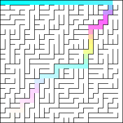
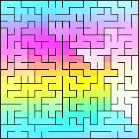
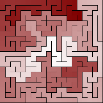
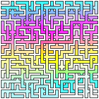
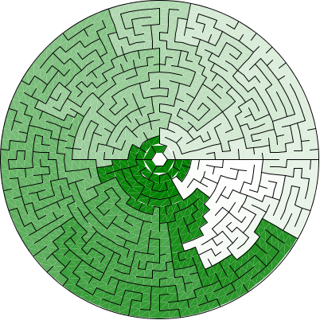
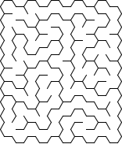
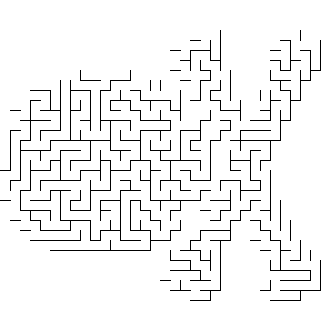
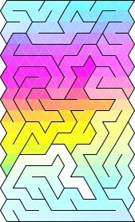
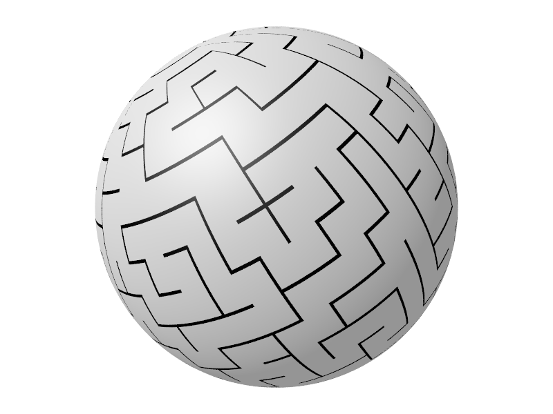
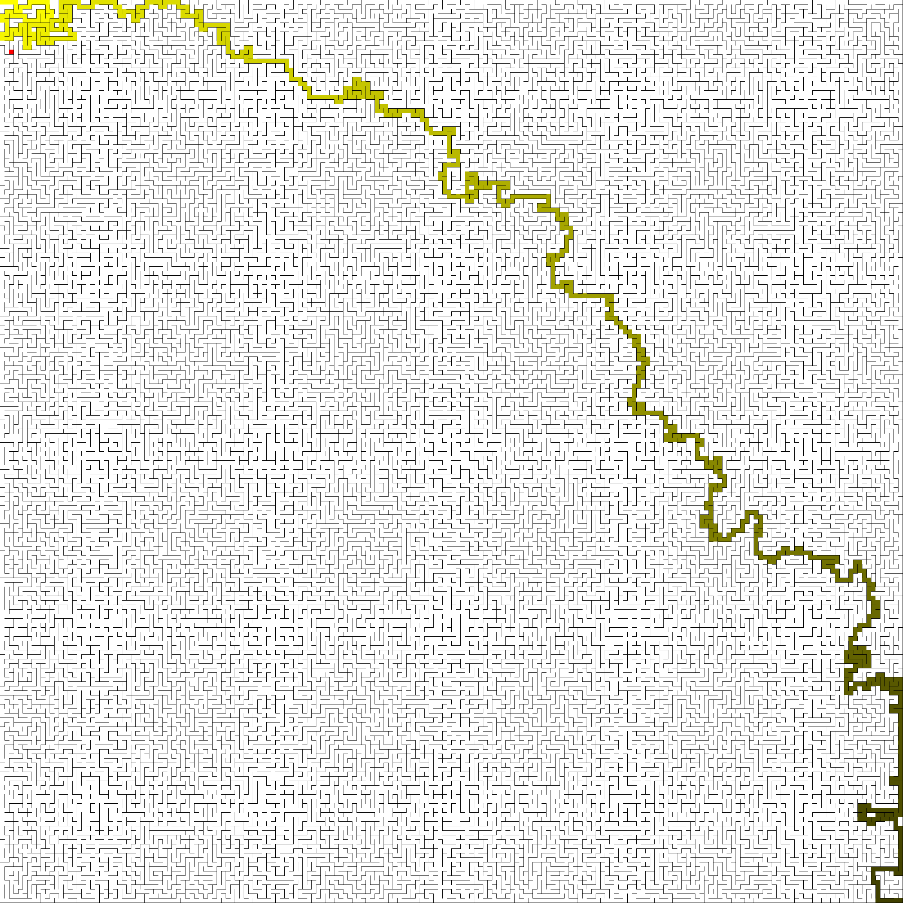

# scala-mazes

Learning Scala by writing maze-generation algorithms

### Credits:
Algorithms & ideas from [Mazes for Programmers](https://pragprog.com/titles/jbmaze/mazes-for-programmers/) by [Jamis Buck](https://twitter.com/jamis?ref_src=twsrc%5Egoogle%7Ctwcamp%5Eserp%7Ctwgr%5Eauthor)
  
## Sample Mazes





















## Running

Using sbt:

  ```
  cd scala-mazes
  sbt
  run --help
  ```
